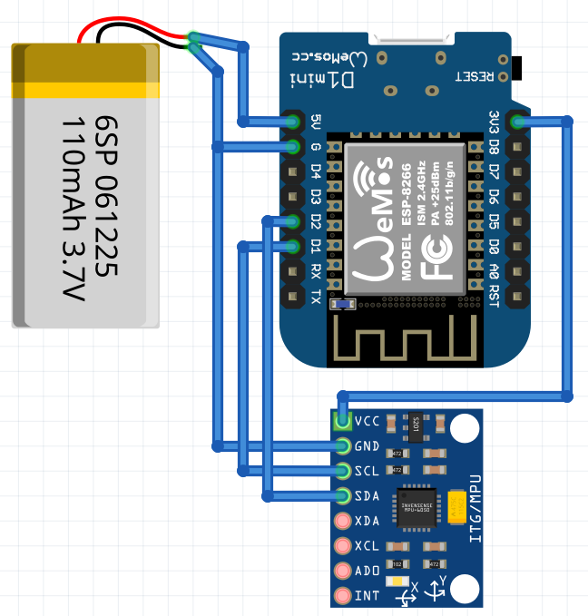
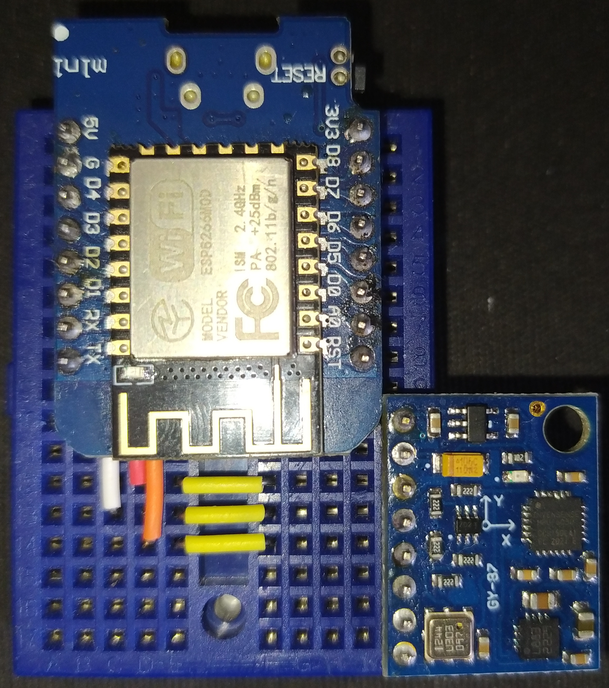

# Motion Tracking Suit

## Table of Contents
1. [Introduction](#introduction)
   - 1.1 Overview
   - 1.2 Project Components
   - 1.3 Features
2. [Installation](#installation)
   - 2.1 Required Libraries
   - 2.2 Hardware Setup
   - 2.3 Software Setup
3. [Arduino Code](#arduino-code)
   - 3.1 Sensor Configuration
   - 3.2 WiFi and UDP Configuration
   - 3.3 Kalman Filter Setup
   - 3.4 Magnetometer Calibration
4. [Sensor Data Update](#sensor-data-update)
   - 4.1 Updating Sensor Data
   - 4.2 Updating MPU6050 Sensor Data
   - 4.3 Updating HMC5883L Sensor Data
   - 4.4 Setting Motion Detection Threshold and Duration for MPU6050
   - 4.5 Enabling Motion Interrupt for MPU6050
   - 4.6 Initializing Kalman Filter Angles (kalAngleX, kalAngleY, kalAngleZ)
5. [UDP Data Sending](#udp-data-sending)
   - 5.1 JSON Data Serialization (sensorGetJson())
   - 5.2 Sending UDP Data (udpSend())
6. [User Interface in Blender](#user-interface-in-blender)
   - 6.1 Blender Plugin Overview
   - 6.2 Server Configuration Panel (SERMOTIONS_PT_server)
   - 6.3 Blender Operators for Start and Save (OT_start, OT_save)
   - 6.4 Blender Panel Registration (register(), unregister())
7. [Unreal Engine Integration](#unreal-engine-integration)
   - 7.1 Plugin Integration in Unreal Engine
   - 7.2 Receiving Motion Tracking Data in Unreal Engine
8. [Folder Structure](#folder-structure)
   - 8.1 Generic Project Folder Structure
9. [Compiling and Uploading Arduino Code Using VS Code and PlatformIO](#compiling-and-uploading-arduino-code-using-vs-code-and-platformio)
   - 9.1 Setting Up PlatformIO in VS Code
   - 9.2 Compiling and Uploading Code to Microcontroller
10. [Conclusion](#conclusion)
   - 10.1 Summary
   - 10.2 Acknowledgments
   - 10.3 License
   - 10.4 Contact Information

---

## 1. Introduction

### 1.1 Overview
The Motion Tracking Suit project is a comprehensive system designed to track real-time motion using Arduino-based sensors and visualize the data in Blender and Unreal Engine. The project offers a versatile solution for motion tracking that finds applications in fields like animation, game development, and virtual reality experiences.

Breadboard Schema             |  Breadboard Montage
:-------------------------:|:-------------------------:
  |  


### 1.2 Project Components
The project comprises three main components:

- **Arduino Code**: Responsible for reading sensor data from MPU6050 and HMC5883L sensors and transmitting it to the server via WiFi and UDP.

- **Python Scripts**: Act as the server to receive sensor data from Arduino and send it to Blender and Unreal Engine using a custom protocol.

- **Blender and Unreal Engine Integration**: Provides user interfaces in Blender and Unreal Engine for configuring server settings and visualizing the motion data.

### 1.3 Features
The Motion Tracking Suit project boasts several key features:

- Real-time motion tracking using Arduino-based sensors.
- Configurable sensor settings and calibration for precise tracking.
- Seamless integration with Blender and Unreal Engine for data visualization.
- User-friendly interfaces in Blender and Unreal Engine for server configuration.

---

## 2. Installation

### 2.1 Required Libraries
Before proceeding, make sure to install the following libraries in your Arduino IDE:

- Wire.h
- Arduino.h
- ESP8266WiFi.h
- WiFiUdp.h
- Adafruit_MPU6050.h
- Adafruit_HMC5883_U.h
- ArduinoJson.h
- Kalman.h

### 2.2 Hardware Setup
To set up the hardware:

1. Connect the MPU6050 and HMC5883L sensors to the Arduino board following the wiring instructions provided in the Arduino code.

### 2.3 Software Setup
Upload the Arduino code to your Arduino board using the Arduino IDE.

---

## 3. Arduino Code

### 3.1 Sensor Configuration
The Arduino code configures the MPU6050 and HMC5883L sensors with specific settings.

```cpp
// Sensor Configuring
Adafruit_MPU6050 mpu6050;
Adafruit_HMC5883_Unified mag = Adafruit_HMC5883_Unified(12345);

// ... (continued in the next snippet)
```

### 3.2 WiFi and UDP Configuration
The code sets up the WiFi connection and UDP port for

 data transmission.

```cpp
// Wifi Configuration
#define WIFI_SSID "YOUR_WIFI_SSID"
#define WIFI_PASSWORD "YOUR_WIFI_PASSWORD"

// Udp Configuration
#define UDP_IP "YOUR_SERVER_IP_ADDRESS"
#define UDP_PORT 4455
#define UDP_JSON true

// ... (continued in the next snippet)
```

### 3.3 Kalman Filter Setup
The code initializes Kalman filter instances for angle calculations.

```cpp
// Kalman Filter Setup
Kalman kalmanX, kalmanY, kalmanZ; // Create the Kalman instances

// ... (continued in the next snippet)
```

### 3.4 Magnetometer Calibration
The code calibrates the magnetometer to improve accuracy.

```cpp
// Magnetometer Calibration
#define MAG0MAX 603
#define MAG0MIN -578

#define MAG1MAX 542
#define MAG1MIN -701

#define MAG2MAX 547
#define MAG2MIN -556

float magOffset[3] = {(MAG0MAX + MAG0MIN) / 2, (MAG1MAX + MAG1MIN) / 2, (MAG2MAX + MAG2MIN) / 2};
double magGain[3];

// ... (continued in the next snippet)
```

---

## 4. Sensor Data Update

### 4.1 Updating Sensor Data
The code updates the sensor data, including acceleration, gyroscope, temperature, and magnetometer readings.

```cpp
// Update all the IMU values
updateMPU6050();
updateHMC5883L();

// ... (continued in the next snippet)
```

### 4.2 Updating MPU6050 Sensor Data
The code reads accelerometer and gyroscope data from the MPU6050 sensor.

```cpp
void updateMPU6050()
{
    sensors_event_t a, g, temp;
    mpu6050.getEvent(&a, &g, &temp);

    accX = a.acceleration.x;
    accY = a.acceleration.y;
    accZ = a.acceleration.z;

    tempRaw = temp.temperature;

    gyroX = g.gyro.x;
    gyroY = g.gyro.y;
    gyroZ = g.gyro.z;
}
```

### 4.3 Updating HMC5883L Sensor Data
The code reads magnetometer data from the HMC5883L sensor.

```cpp
void updateHMC5883L()
{
    sensors_event_t event;
    mag.getEvent(&event);

    magX = event.magnetic.x;
    magY = event.magnetic.y;
    magZ = event.magnetic.z;

    // ... (continued in the next snippet)
```

### 4.4 Setting Motion Detection Threshold and Duration for MPU6050
The code sets motion detection threshold and duration for the MPU6050 sensor.

```cpp
mpu6050.setMotionDetectionThreshold(1);
mpu6050.setMotionDetectionDuration(20);
```

### 4.5 Enabling Motion Interrupt for MPU6050
The code enables motion interrupt for the MPU6050 sensor.

```cpp
mpu6050.setInterruptPinLatch(true);
mpu6050.setInterruptPinPolarity(true);
mpu6050.setMotionInterrupt(true);
```

### 4.6 Initializing Kalman Filter Angles (kalAngleX, kalAngleY, kalAngleZ)
The code initializes Kalman filter angles for roll, pitch, and yaw.

```cpp
kalmanX.setAngle(roll); // First set roll starting angle
gyroXangle = roll;
compAngleX = roll;

kalmanY.setAngle(pitch); // Then pitch
gyroYangle = pitch;
compAngleY = pitch;

kalmanZ.setAngle(yaw); // And finally yaw
gyroZangle = yaw;
compAngleZ = yaw;
```

---

## 5. UDP Data Sending

### 5.1 JSON Data Serialization (sensorGetJson())
The code serializes sensor data into JSON format.

```cpp
String sensorGetJson()
{
    updateSensor();
    StaticJsonDocument<1024> static_json_document;

    // Get acceleration values
    int axis[3] = {roll, pitch, yaw};
    calculateAxis(axis);
    static_json_document["roll"] = axis[0];
    static_json_document["pitch"] = axis[1];
    static_json_document["yaw"] = axis[2];

    char doc_buffer[1024];
    serializeJson(static_json_document, doc_buffer);

    return String(doc_buffer);
}
```

### 5.2 Sending UDP Data (udpSend())
The code sends the serialized JSON data via UDP.

```cpp
void udpSend(String message, int delay_ms)
{
    Udp.beginPacket(UDP_IP, UDP_PORT);
    Udp.write(message.c_str());
    Udp.endPacket();
    Serial.printf("Sending packet: %s\n", message.c_str());
    delay(delay_ms);
}
```

---

## 6. User Interface in Blender

### 

6.1 Blender Plugin Overview
The Blender plugin provides a user interface for configuring server settings and controlling data streaming.

### 6.2 Server Configuration Panel (SERMOTIONS_PT_server)
The server configuration panel allows users to set the IP address and port for data transmission.

```python
class SERMOTIONS_PT_server(bpy.types.Panel):
    bl_idname = "SERMOTIONS_PT_server"
    bl_label = "Server Configuration"
    bl_category = "Sermotions"
    bl_space_type = "VIEW_3D"
    bl_region_type = "UI"

    def draw(self, context):
        layout = self.layout
        scene = context.scene
        props = scene.props

        layout.prop(props, "ip")
        layout.prop(props, "port")

        # ... (continued in the next snippet)
```

### 6.3 Blender Operators for Start and Save (OT_start, OT_save)
The Blender operators handle the events for starting and saving server configurations.

```python
class SERMOTIONS_PT_server(bpy.types.Panel):
    # ... (previous code)
    
    class OT_save(bpy.types.Operator):
        bl_label = "Save"
        bl_idname = "sermotions.save"

        def execute(self, context):
            config.write()
            SERMOTIONS_PT_server.status_print(self, "Server configuration is saved.")
            return {"FINISHED"}

    class OT_start(bpy.types.Operator):
        bl_label = "Start"
        bl_idname = "sermotions.start"

        def execute(self, context):
            global proc_server
            if not proc_server.is_alive():
                proc_server.start()
                SERMOTIONS_PT_server.status_print(self, "Server started.")
                print_debug("UDP server started.")
            else:
                proc_server.terminate()
                SERMOTIONS_PT_server.status_print(self, "Server stopped.")
                proc_server = create_process_server()
                print_debug("UDP server stopped.")
            return {"FINISHED"}

    # ... (continued in the next snippet)
```

### 6.4 Blender Panel Registration (register(), unregister())
The register and unregister functions are used to add the server configuration panel to Blender's user interface.

```python
def register():
    bpy.utils.register_class(SERMOTIONS_PT_main)
    bpy.utils.register_class(SERMOTIONS_PT_server)
    bpy.utils.register_class(SERMOTIONS_PT_server.OT_save)
    bpy.utils.register_class(SERMOTIONS_PT_server.OT_start)
    bpy.types.Scene.server_status = bpy.props.StringProperty()

    bpy.types.Scene.props = bpy.props.PointerProperty(type=SERMOTIONS_PT_server.PT)

def unregister():
    bpy.utils.unregister_class(SERMOTIONS_PT_main)
    bpy.utils.unregister_class(SERMOTIONS_PT_server)
    bpy.utils.unregister_class(SERMOTIONS_PT_server.OT_save)
    bpy.utils.unregister_class(SERMOTIONS_PT_server.OT_start)
    del bpy.types.Scene.server_status
    del bpy.types.Scene.props
```

---

## 7. Unreal Engine Integration

### 7.1 Plugin Integration in Unreal Engine
The project's Unreal Engine plugin facilitates the integration of the motion tracking system.

### 7.2 Receiving Motion Tracking Data in Unreal Engine
The plugin enables Unreal Engine to receive motion tracking data and use it for various applications.

---

## 8. Folder Structure

### 8.1 Generic Project Folder Structure
Organizing your project files in a structured manner ensures clarity and ease of management. Below is a suggested generic folder structure for your electronics project:

```
MotionTrackingSuit/
│
├── ArduinoCode/
│   ├── src/
│   └── lib/
│
├── BlenderPlugin/
│   ├── scripts/
│   └── icons/
│
├── UnrealPlugin/
│   ├── Source/
│   └── Resources/
│
└── Documentation/
    ├── Images/
    │   ├── ArduinoConnections.png
    │   ├── BlenderPluginInterface.png
    │   ├── UnrealIntegration.png
    │   └── ...
    ├── README.md
    └── ...

```

---

## 9. Compiling and Uploading Arduino Code Using VS Code and PlatformIO

### 9.1 Setting Up PlatformIO in VS Code
To streamline the development process, you can use Visual Studio Code (VS Code) with the PlatformIO extension to compile and upload the Arduino code to your microcontroller. Here's how to set it up:

1. Install [Visual Studio Code](https://code.visualstudio.com/).
2. Install the [PlatformIO IDE](https://platformio.org/platformio-ide) extension for VS Code.
3. Open your project folder in VS Code.

### 9.2 Compiling and Uploading Code to Microcontroller
With the PlatformIO extension installed, follow these steps to compile and upload the Arduino code to your microcontroller:

1. Open the Arduino code file in VS Code.
2. Click on the "Checkmark" icon in the PlatformIO toolbar to compile the code.
3. Once compiled successfully,

 click on the "Arrow" icon to upload the code to your microcontroller.

---

## 10. Conclusion

### 10.1 Summary
The Motion Tracking Suit project offers a comprehensive solution for real-time motion tracking using Arduino-based sensors. With integration in Blender and Unreal Engine, the project opens up possibilities in animation, game development, and virtual reality experiences.

### 10.2 Acknowledgments
We would like to express our gratitude to all contributors and collaborators who made this project possible.

### 10.3 License
This project is licensed under the [MIT License](LICENSE).

### 10.4 Contact Information
For any inquiries or assistance, feel free to contact us at [seyupaltin@gmail.com](mailto:seyupaltin@gmail.com).

---
